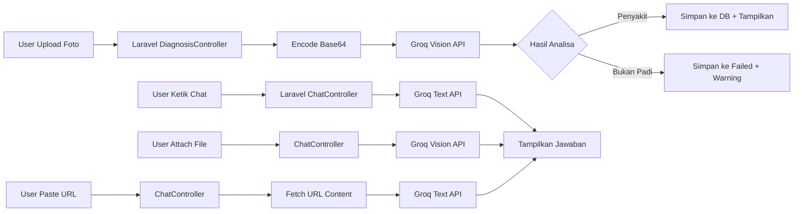

<p align="center">
  
  
  
  
</p>

# 🌾 Pohaci AI — Ngariksa Pare, Ngajaga Lemah Cai

**Pohaci AI** adalah aplikasi web berbasis Laravel untuk **deteksi penyakit tanaman padi** menggunakan kecerdasan buatan (AI). Aplikasi ini memanfaatkan **Groq Cloud API** dengan model **Llama 4 Scout Vision** untuk menganalisa gambar daun padi secara real-time, serta menyediakan chatbot AI untuk konsultasi pertanian.

> *"Pohaci"* diambil dari Dewi Sri (Nyi Pohaci) dalam mitologi Sunda — dewi padi dan kesuburan.

---

## ✨ Fitur Utama

### 🔬 Diagnosa Penyakit Padi
- Upload foto daun padi → AI menganalisa dan mendeteksi penyakit
- Menampilkan **nama penyakit**, **confidence level (%)**, dan **solusi penanganan**
- Otomatis menggunakan model **Llama 4 Scout Vision** untuk analisa gambar
- Data diagnosa tersimpan di database untuk monitoring

### 💬 Chatbot AI Interaktif
- Konsultasi pertanian padi secara real-time dengan AI
- **📎 Attach File** — Kirim gambar langsung di chat untuk analisa
- **🔗 Add URL** — Paste link halaman web untuk dianalisa AI
- Model AI otomatis dipilih sesuai konteks (text vs vision)

### 📊 Dashboard Monitoring (Admin)
- Statistik diagnosa: total scan, penyakit terdeteksi, akurasi rata-rata
- Tabel data diagnosa valid dengan pagination
- Tabel data upload gagal/non-padi
- Fitur hapus data dan export laporan ke Excel/CSV
- Dilindungi autentikasi (login required)

### 🔐 Autentikasi
- Login & Register dengan desain modern (Tailwind CSS + Glassmorphism)
- Proteksi halaman admin dengan middleware `auth`
- Fitur lupa password & verifikasi email

---

## 🛠️ Tech Stack

| Layer | Teknologi |
|-------|-----------|
| **Backend** | Laravel 8.x, PHP 8.0 |
| **AI Engine** | Groq Cloud API (Llama 3.3 70B, Llama 4 Scout Vision) |
| **Frontend** | Blade Templates, Tailwind CSS, Axios |
| **Database** | MySQL (Eloquent ORM) |
| **Auth** | Laravel UI |

---

## 🧠 Model AI yang Digunakan

| Fungsi | Model | Provider |
|--------|-------|----------|
| Chat text & URL analysis | `llama-3.3-70b-versatile` | Meta/Groq |
| Analisa gambar (Vision) | `meta-llama/llama-4-scout-17b-16e-instruct` | Meta/Groq |
| Diagnosa penyakit daun | `meta-llama/llama-4-scout-17b-16e-instruct` | Meta/Groq |

---

## ⚙️ Instalasi

### Prasyarat
- PHP >= 8.0
- Composer
- MySQL
- [Groq API Key](https://console.groq.com) (gratis)

### Langkah Instalasi

```bash
# 1. Clone repository
git clone https://github.com/bensu89/sistem-pakar-padi-ai.git
cd sistem-pakar-padi-ai

# 2. Install dependensi PHP
composer install

# 3. Konfigurasi environment
cp .env.example .env

# 4. Generate application key
php artisan key:generate

# 5. Konfigurasi database di .env
# DB_DATABASE=padi_db
# DB_USERNAME=root
# DB_PASSWORD=

# 6. Konfigurasi Groq API di .env
# GROQ_API_KEY=your_groq_api_key_here
# GROQ_DEFAULT_MODEL=llama-3.3-70b-versatile

# 7. Jalankan migrasi database
php artisan migrate

# 8. Buat symbolic link untuk storage
php artisan storage:link

# 9. Jalankan server
php artisan serve
```

Buka `http://localhost:8000` di browser.

---

## 📂 Struktur Aplikasi

```
padi-web/
├── app/
│   ├── Http/Controllers/
│   │   ├── DiagnosisController.php    # Upload & diagnosa padi (Groq Vision)
│   │   ├── ChatController.php         # Chatbot AI (text, file, URL)
│   │   └── AdminController.php        # Dashboard monitoring
│   ├── Models/
│   │   ├── Diagnosis.php              # Model data diagnosa valid
│   │   └── FailedUpload.php           # Model data upload gagal
│   └── Services/
│       └── GroqService.php            # Service komunikasi Groq API
├── resources/views/
│   ├── home.blade.php                 # Halaman utama (scan + chat)
│   ├── admin/index.blade.php          # Dashboard admin
│   └── auth/                          # Halaman login, register, dll
├── routes/
│   └── web.php                        # Definisi semua route
└── config/
    └── services.php                   # Konfigurasi Groq API
```

---

## �️ Route Aplikasi

| Method | URI | Fungsi |
|--------|-----|--------|
| `GET` | `/` | Halaman utama (diagnosa + chatbot) |
| `POST` | `/analyze` | Proses upload & diagnosa gambar |
| `POST` | `/chat` | Kirim pesan chat ke AI |
| `GET` | `/monitoring-penelitian` | Dashboard admin (auth) |
| `DELETE` | `/monitoring-penelitian/{id}` | Hapus data diagnosa (auth) |
| `GET` | `/export-laporan` | Export laporan Excel/CSV (auth) |
| `GET` | `/login` | Halaman login |
| `GET` | `/register` | Halaman registrasi |

---

## 📸 Alur Kerja



---

## 🔒 Keamanan

- ✅ CSRF Protection pada semua form dan AJAX request
- ✅ XSS Prevention — escape HTML pada input chat
- ✅ Mass Assignment Protection — model menggunakan `$fillable`
- ✅ Admin routes dilindungi middleware `auth`
- ✅ Groq API key disimpan aman di `.env` (tidak di-commit)
- ✅ Validasi input pada semua controller

---

## 🤝 Kontribusi

Kontribusi sangat diterima! Silakan fork, buat branch, dan submit Pull Request.

```bash
git checkout -b fitur-baru
git commit -m "Tambah fitur baru"
git push origin fitur-baru
```

---

## 📝 Lisensi

Project ini dilisensikan di bawah [MIT License](https://opensource.org/licenses/MIT).

---

<p align="center">
  Dibuat dengan ❤️ untuk pertanian Indonesia 🇮🇩
</p>
